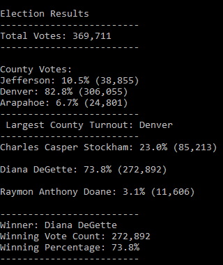

# Election-Analysis

## Purpose
The purpose of this analysis is to provide additional data to complete the audit of the local congressional election.

## Project Overview
A Colorado Board of Elections employee has provided the following tasks to complete the election audit of a recent local congressional election. They are:

1. Calculate the total number of Votes cast
2. Get a complete list of candidates who recieved votes
3. Calculate the percentage of votes each candidates won
4. Calculate the total number of votes each candidate won
5. Determine the winner of the election based on popular vote

## Resources
- **Data Source:** election_results.csv
- **Software:** Python 3.7.3, Visual Code, 1.47

## Election Audit Results
### Candidate Audit Results
> To begin the analysis, the total number of votes cast needed to be determined. This was done by first initializing the variable `total_votes` to zero (0), which will increment by 1 as it read each row in the `for loop`. The code used to increment said variable by one(1) is `total_votes +=1`.
>  To retrieve the votes and percentages for each candidate, a `for loop` was used to iterate through the list of `candidate_options =[]` to get identify the candidate options. Said `for loop` variable was used to retrieve the votes of the different candidates from the dictionary `candidate_votes = {}`. The percentage of the vote `vote_percentage` was then calculated, for this the variable `votes` and `total_votes` was converted to a floating decimal numbers. The following code was used to retrieve vote count and percentage for each candidate:
>
>        `for candidate_name in candidate_votes:
>        # Retrieve vote count and percentage
>        votes = candidate_votes.get(candidate_name)
>        vote_percentage = float(votes) / float(total_votes) * 100
>        candidate_results = (
>            f"{candidate_name}: {vote_percentage:.1f}% ({votes:,})\n")`
>
>**The analysis of the election show that:**
> - There were `"369, 711"` votes cast in the election.
> - The candidates were:
>     - Charles Casper Stockham
>     - Diana DeGette
>     - Raymon Anthony Doane
>            
>- The candidate results were:
>   - Charles Casper Stockham recieved `"23.0%"` of the vote and `"85, 213"` number of votes
>   - Diana DeGette recieved `"73.8%"` of the vote and `"272, 892"` number of votes
>   - Raymon Anthony Doane recieved `"3.1%"` of the vote and `"11, 606"` number of votes
>  
>- The winner of the election was:
>   - Diana DeGette, who recieved `"73.8%"` of the vote and `"272, 892"` number of votes.

### County Audit Results
> The code used to identify candidate name , votes and percentages were refactored to create a similar analysis, one that speaks specifically to the county turnout aspect. What that means is that the same methods used to identify the candidate outcomes are indeed the same used to analyze the county outcomes. The difference is that variables created here are repesentative of the county dataset. For example:
>
>       `for county in county_votes:
>        # 6b: Initialize a variable to hold the county’s votes as they are retrieved from the county votes dictionary
>        votes_county = county_votes[county]
>         # 6c: Calculate the percent of total votes for the county
>         # 6d: Print the county results to the terminal.
>         county_results = (
>           f"{county}: {percent_county:.1f}% ({votes_county:,})\n")`
>
>**The Election was conducted in three (3) counties. They are:**
>- Jefferson County
>- Denver County
>- Arapahoe County
>
>All three countie combined had total of `369, 711` votes.
>
>**The county turnout results were:**
>  - Jefferson County recieved `"10.5%"` of the vote and `"38, 855"` number of votes  
>  - Denver County recieved `"82.8%"` of the vote and `"306, 055"` number of votes
>  - Arapahoe County recieved `"6.7%"` of the vote and `"24, 801"` number of votes
>The county with the largest turnout is Denvefr with `306, 055` votes and `82.8%` total turnout. 

>**Table showing Elections Results from Terminal:**
>
>
  
## Election Audit Summary
>With some modification this script can be used to retrieve a deeper analysis on the demographics of the each coumty, and like wise to get a glimpse of the candidates supporters. Script can be used to find out whether we have a larger turnout of younger or older population, the gender, race etc. These are key and important metrics, that can be made available in a matter of seconds. This can be done, by swapping out and or creating new variable names such as county and or county names. 
>
>The same script can be also used for other elections to determine the prefered method or most used method of voting, providing that the data is available.

